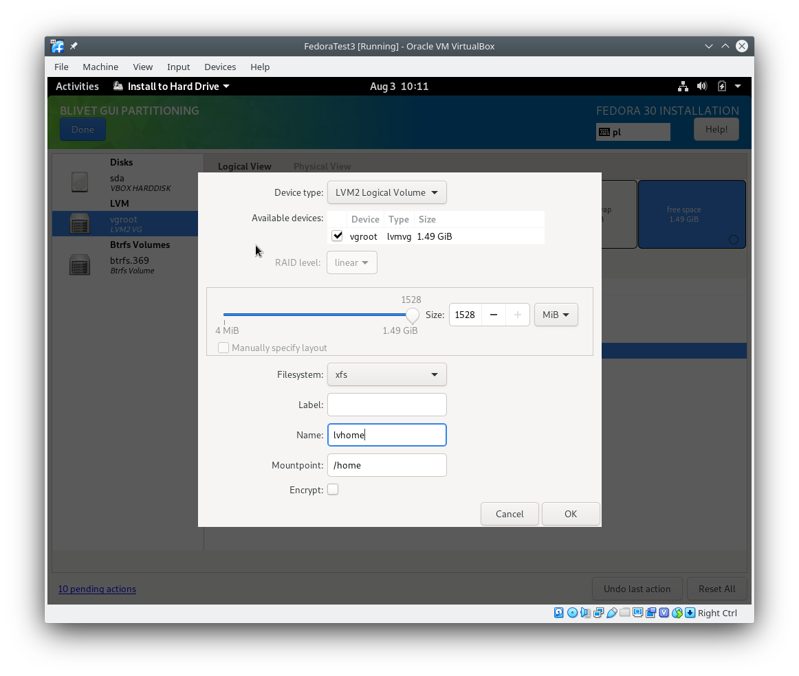

# Fedora 30 linux install with luks + enrypted boot partition + btrfs snapper walkthrough (both EFI and BIOS)
First we install Fedora with unencrypted boot parition only to move the boot folder to the encrypted root partion after reboot.

Skip /boot/efi parition for BIOS installs

After reboot modify [migrate.sh](migrate.sh) to your liking and run it. [migrate.sh](migrate.sh) should:
1. move the unencrypted /boot partition to /boot folder on the encrypted root partition
2. override the old /boot partition with random data and delete it
3. install and configure snapper
4. refresh grub config